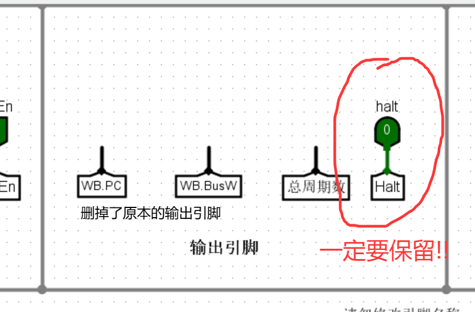
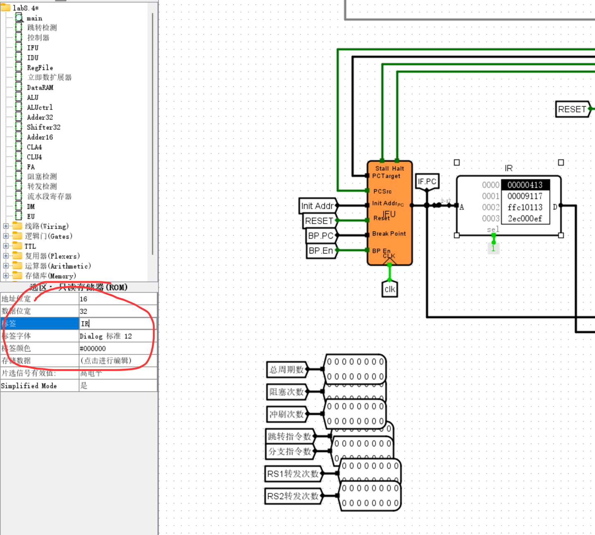
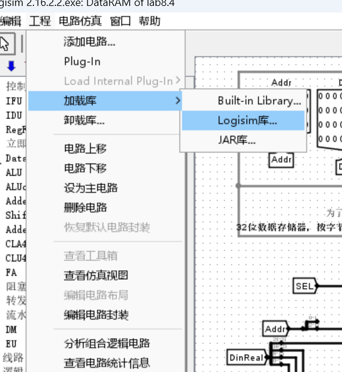
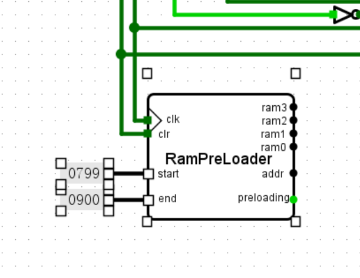
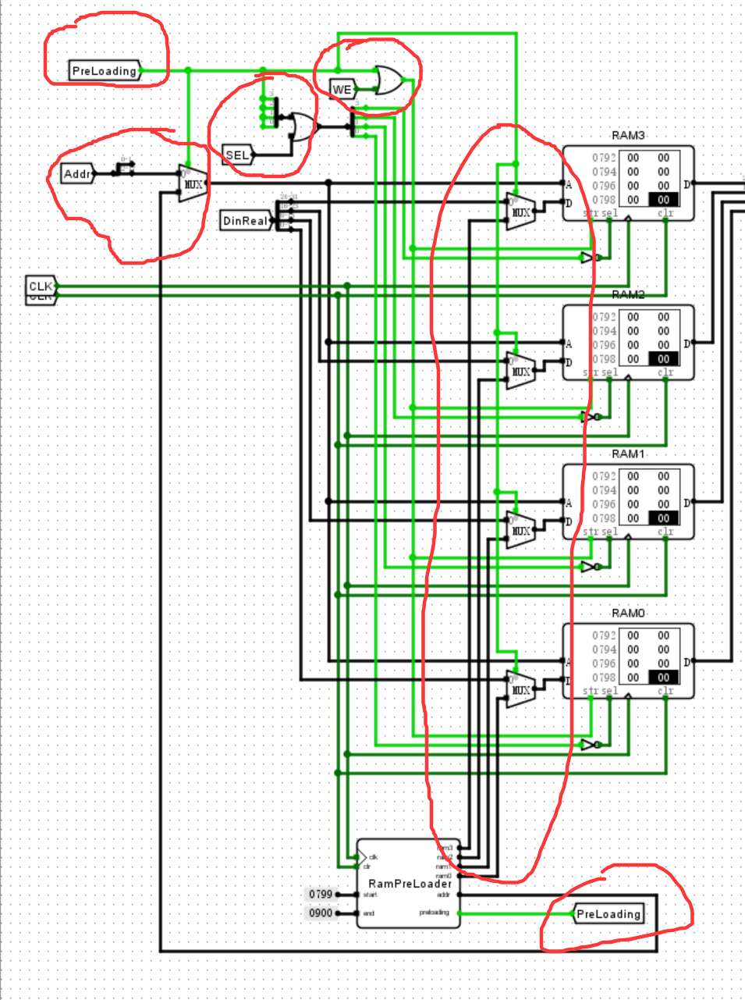
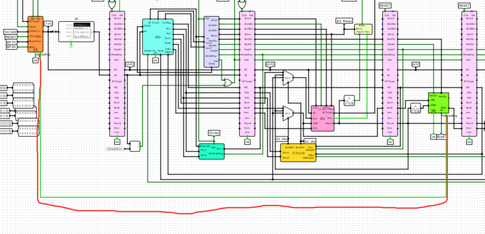
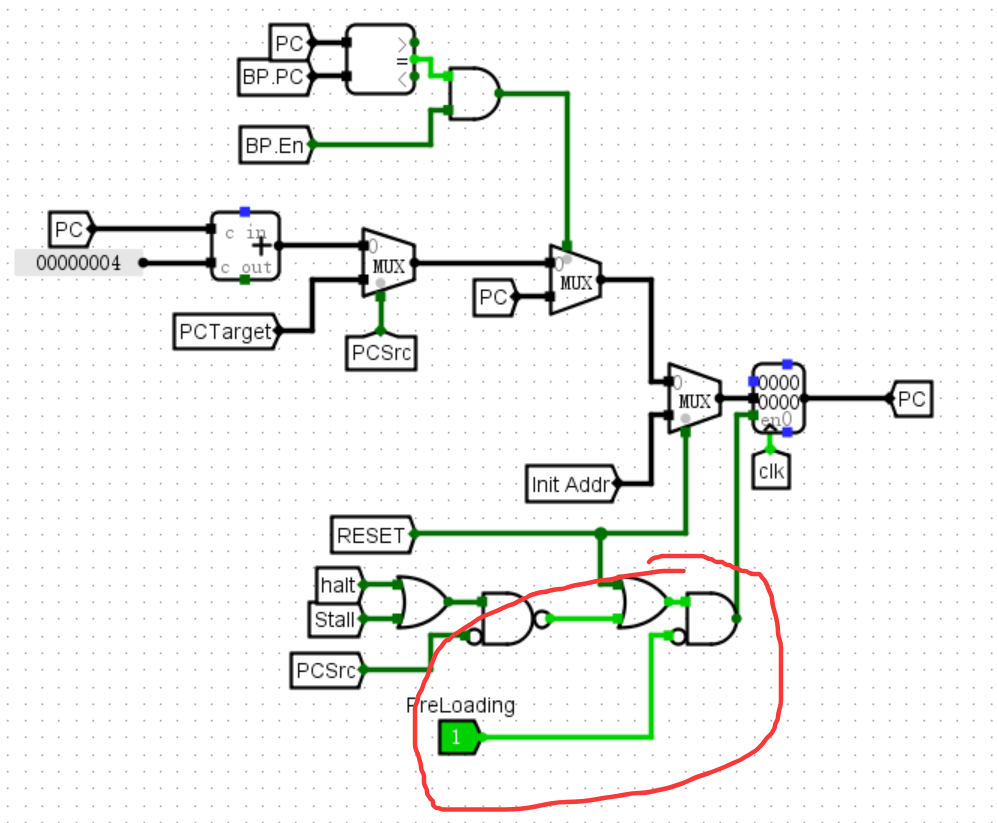

# NJU DLCO 流水线 CPU 自动测试脚本
本项目为 NJU 《数字逻辑与计算机组成》课程的实验：流水线 CPU 设计与测试中“官方测试验证”一节提供自动化测试脚本，它通过修改 Logisim `.circ` 文件中的 ROM 内容，并调用 Logisim 的 `-tty table` 输出，从测试样例中获取仿真结果。

> 注：本脚本会直接修改 `<CPU电路文件>` 和 `rpl.circ` 中 ROM 的内容，建议先备份原文件。

## 项目文件说明
- `autotest.py`：自动测试脚本
- `rpl.circ`：RAM 预加载模块，用于支持需要加载 RAM 数据的测试用例
- `testcase/`：存放官方测试样例的目录
- `README.md`：使用说明文档

## 原理
Logisim 的 `-tty table` 参数可以让仿真结果以表格形式输出，并使用 `halt` 信号作为停止标志。

脚本通过以下方式完成测试：
- 将指令测试数据写入 CPU 电路文件中的 `IR` ROM
- 如果启用了 `RPL`，则将 RAM 预加载数据写入 `rpl.circ` 中的 ROM
- 通过命令行启动 Logisim 仿真，并读取最终输出结果

由于 Logisim 不支持在命令行中一次性加载多份 RAM 数据，本项目采用 ROM 预加载方式，将测试数据先写入电路文件，再让电路在仿真开始前完成 RAM 初始化。

## 所需环境
- Python 3.x
- Logisim ITA
- 已备份的 Logisim 电路文件（`.circ`）

## 使用说明

### 1. 准备电路文件
- 将需要监测的数据连接到主电路输出引脚
- 删除不需要的输出引脚
- 保留 `halt` 引脚，否则测试无法自动停止



### 2. 修改指令寄存器标签
- 将指令寄存器的标签改为 `IR`
  

### 3. 可选：修改 DataRam 以支持 RAM 预加载
如果你要测试带 RAM 数据的用例，需要对电路进行以下修改：
- 下载并导入项目中的 `rpl.circ`
  
- 在 DataRam 中插入 `RPL` 模块，并连接 `clk`、`clr` 等信号，设置加载地址范围
  
- 在 `preloading` 有效时启用写入与片选信号，并载入 RAM 的相关数据
  
- 在 `DataRam` 中新增 `preloading` 输出，在 `IFU` 中新增 `preloading` 输入，在主电路中连接二者
  
  
- 使 `IFU` 在预加载阶段禁用 PC 寄存器输出（保持 PC 为 0）
  

如果你只测试不需要 RAM 数据加载的用例，可以跳过此步。

### 4. 配置脚本参数
编辑 `autotest.py` 中的配置项：
```python
CPU_CIRC = "./lab8.4.circ"        # CPU 电路文件路径
RPL = True                        # 是否启用 RAM 预加载
RPL_CIRC = "./rpl.circ"           # RAM 预加载模块路径
TESTCASES_PATH = './testcase/'    # 测试用例目录
LOGISIM_EXE_OR_JAR = False        # True 表示直接执行 Logisim 可执行文件，False 表示使用 java -jar
LOGISIM_PATH = "./logisim.jar"    # Logisim ITA 可执行文件或 jar 路径
LOG = False                       # 是否输出调试日志
```

### 5. 运行脚本
在命令行中执行：
```bash
python autotest.py
```

如果需要调试信息，将 `LOG = True`。

## 输出示例
脚本会将每个测试用例的结果按竖线分隔形式输出，例如：

```
1|add|493|0|16|0|68|84|120
2|addi|252|0|7|0|37|53|47
3|and|513|0|16|0|57|158|92
...
```

## 注意事项
- 运行前请务必备份 `<CPU电路文件>` 和 `rpl.circ`
- 如果你使用的是 Logisim 可执行文件，请将 `LOGISIM_EXE_OR_JAR = True`
- 如果你使用的是 `jar` 包，请将 `LOGISIM_EXE_OR_JAR = False`
- 若脚本报错，请检查以下路径是否正确：
  - `CPU_CIRC`
  - `RPL_CIRC`
  - `TESTCASES_PATH`
  - `LOGISIM_PATH`
- 测试所有用例通常需要较长时间，约几分钟到十几分钟不等- `testcase/` 目录通常不包含在公开仓库中，建议由使用者自行准备官方测试集
- 本仓库提供自动化脚本与电路修改方案，测试集来源请自行确认授权和使用规则
## 杂谈
急哭是第一生产力。实验这一节里没有 OJ，需要自行打开提供的官方测试集文件，在流水线 CPU 中加载每条指令的测试文件并填写表格，这一过程非常繁琐。\
笔者在绝望之下试图编写这个脚本简化点工作，本来也打算顺便分享给同学的。结果等写完的时候已经来不及了，而且因为 Logisim 功能实在太有限了，一开始没想到解决不能同时加载多份 `.hex` 文件到不同 RAM 的问题，后来鬼脑发动出了用 ROM 预加载的下策，不过还是得根据脚本针对性的修改硬件，不是很优雅，灵活性也算不高，所以最后还是只好拿来自用了，放出去估计也帮助不到多少人。\
最近闲着没事就决定还是要把脚本分享出来，就当是交流学习吧…… 这也算是我第一次在 github 上面扔点东西，也当是积累点经验？不得不说我的代码管理的挺混乱的，这几天稍微整理重构了一下才勉强能看了，注释和 README 也写得一塌糊涂，最后还是扔给 copilot 叫它帮忙润色一下了唔。（一开始脚本文件名甚至是直抒胸臆的表达了对 Logisim 的“赞扬”，电路文件里也是各种粗鄙语言，想想要发到公共平台上影响不太好，于是还是改掉了。）